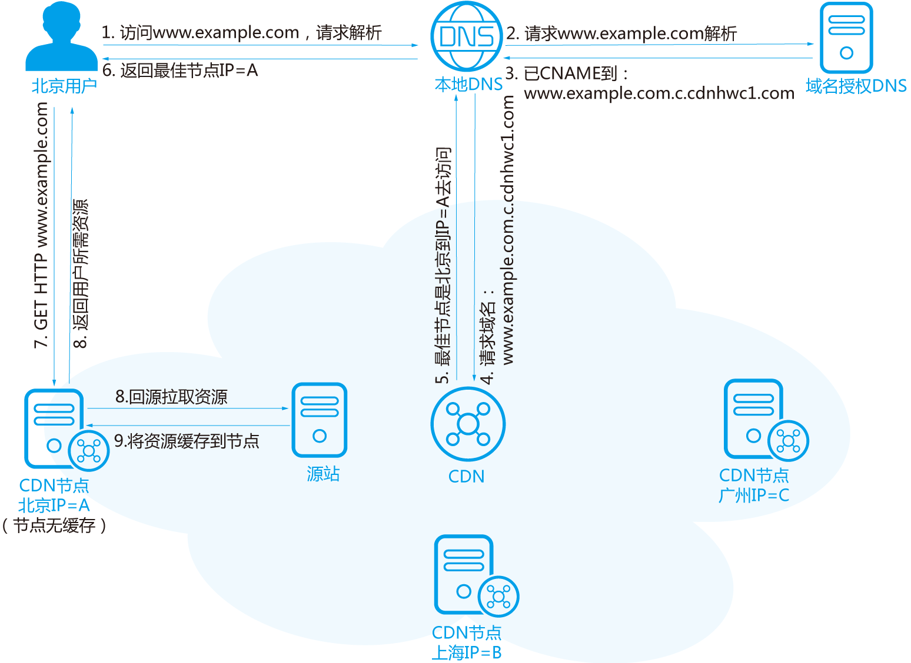

# CDN
CDN（Content Delivery Network，内容分发网络）是构建在现有互联网基础之上的一层智能虚拟网络，通过在网络各处部署节点服务器，实现将源站内容分发至所有CDN节点，使用户可以就近获得所需的内容。CDN服务缩短了用户查看内容的访问延迟，提高了用户访问网站的响应速度与网站的可用性，解决了网络带宽小、用户访问量大、网点分布不均等问题。

## 加速原理
当用户访问使用CDN服务的网站时，本地DNS服务器通过CNAME方式将最终域名请求重定向到CDN服务。CDN通过一组预先定义好的策略(如内容类型、地理区域、网络负载状况等)，将当时能够最快响应用户的CDN节点IP地址提供给用户，使用户可以以最快的速度获得网站内容。使用CDN后的HTTP请求处理流程如下：

### CDN节点有缓存场景

1. 用户在浏览器输入要访问的网站域名，向本地DNS发起域名解析请求。
2. 域名解析的请求被发往网站授权DNS服务器。
3. 网站DNS服务器解析发现域名已经CNAME到了www.example.com.c.cdnhwc1.com。
4. 请求被指向CDN服务。
5. CDN对域名进行智能解析，将响应速度最快的CDN节点IP地址返回给本地DNS。
6. 用户获取响应速度最快的CDN节点IP地址。
7. 浏览器在得到速度最快节点的IP地址以后，向CDN节点发出访问请求。
8. CDN节点将用户所需资源返回给用户。

### CDN节点无缓存场景

1. 用户在浏览器输入要访问的网站域名，向本地DNS发起域名解析请求。
2. 域名解析的请求被发往网站授权DNS服务器。
3. 网站DNS服务器解析发现域名已经CNAME到了www.example.com.c.cdnhwc1.com。
4. 请求被指向CDN服务。
5. CDN对域名进行智能解析，将响应速度最快的CDN节点IP地址返回给本地DNS。
6. 用户获取响应速度最快的CDN节点IP地址。
7. 浏览器在得到速度最快节点的IP地址以后，向CDN节点发出访问请求。
8. CDN节点回源站拉取用户所需资源。
9. 将回源拉取的资源缓存至节点。
10. 将用户所需资源返回给用户。

PS：CNAME别名解析是将域名指向一个网址（域名）